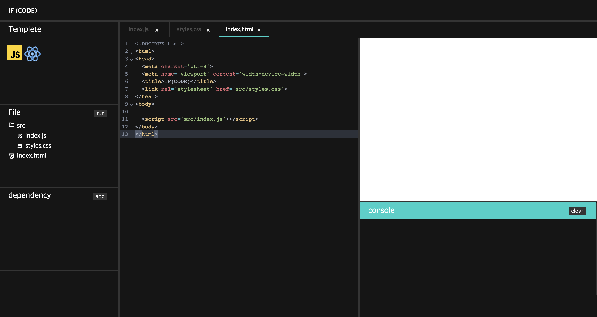

<br>

# 💻  IF (CODE)


[](https://app.netlify.com/sites/easymemd/deploys)

`#CodeEditor` `#html #css #javascript` `#react`

---

html, css, javascript 프로그래밍 언어 사용해보신적 있나요??

**IF (CODE)** 를 통해 한번 html, css, javascript 그리고 외부 라이브러리를 통해 나만의 코드를 작성 해보시죠.

더 나아가 React까지 경험해 볼 수 있는 온라인 코드에디터, **IF(CODE)**

<br>

# 💡 Motivation
평소에 jsbin, codepen, codesandbox 등등 다양한 코드에디터를 사용해보다가 나도 이런 코드에디터들을 어떻게 구현 되어 있나?! 라는 생각에 시작하겠습니다.

<br>

# 🔗 Link

- [https://www.ifcode.online/](https://www.ifcode.online/)

<br>

# 🔍 IN USE

#### 1. 왼쪽 상단에 각각 템플릿을 클릭 하게 되면 보일러플레이트 적용 되어 있습니다.
#### 2. 각 템플릿 아이콘을 클릭후 "sample" 버튼을 클릭하면 예시 코드가 적용됩니다.
#### 3. File 메뉴에서 "run" 버튼을 클릭하면 입력하신 코드가 실행됩니다.
#### 4. 각 폴더, 파일을 생성, 수정, 삭제가 가능합니다.
#### 5. 각 코드, 실행되어진 화면, 터미널을 영역을 드래그 하여 크기를 조절 할 수 있습니다.

<br>

# 🛠 Features
- File Tree Structure
    - 왼쪽 메뉴바에서 파일 구조를 구성할 수 있습니다.
    - 각각 js, css, html 파일 생성 및 파일 이름 수정 그리고 삭제할 수 있습니다.
    - 각 파일들을 폴더로 관리할 수 있습니다. 해당 폴더도 생성, 이름 수정 삭제할 수 있습니다.

- 외부 라이브러리 관리
    - 외부 라이브러리는 CDN 주소를 입력하게 되면 해당 라이브러리를 사용할 수 있도록 디펜더시에 추가됩니다.
    - skypack(https://www.skypack.dev/) CDN 이용

- 코드 편집기
    - 각 파일 구조에서 생성된 파일들을 클릭하면 각 파일들을 탭으로 관리되면 현재는. js, .css, .html 파일 별로 코드 편집기에 해당 프로그래밍 언어로 스타일이 적용되어 있습니다.
    - js 파일에서 다른 js 파일 import / export 하여 사용할 수 있고 디펜더시에 등록된 외부 라이브러리 가져와 사용할 수 있습니다.
    - 해당 파일들을 모두 작성한 뒤에 run 버튼을 누르면 react는 정해진 진입 전(entryPoint)가 있어 해다 파일부터 읽어 iframe를 사용하여 화면에 보여줍니다. 자바스크립트는 html 파일에 등록된 script 태그를 읽어 해당 코드를 실해하여 화면에 보여줍니다.
- 로그 터미널
  - console.log를 보여주는 터미널 창입니다.

<br>

# ⚠️ Requirement

최신 Chrome Browser 사용을 권장합니다.  

현재 react-redux 라이브러리 최신 버젼을 사용하게 된다면 오류가 있어 버젼을 아래와 같이 명시해 주시면 감사하겠습니다.  
https://cdn.skypack.dev/react-redux@7.2.6


<br>

# ⚙️ Installation

## Client

```
git clone https://github.com/IFCOD-ing/IFCODE.git
npm install
npm start
```

<br>

# 🪛 Project Control

- Version Control: Git, Github
- Task Control: Notion, Figma

<br>

# 🚀 Deployment

- Client: Netlify

<br>

# 🧗 Challenges

2주 동안 기능 개발을 하면서 겪은 어려움 또는 도전은 아래와 같습니다.

<br>

## 1. javscript 파일, import / export

### 1) require 구문으로 변환

사용자가 입력한 코드 import, export 구문은 선언문이어서 제가 직접적으로 해당 코드를 제어하기가 어려운 점이 있어 파일 가져오기 / 내보내기를 같은 기능을 하는 require() 즉, 함수 실행문을 사용하는 require 구문으로 변환하여 사용하였습니다.

해당 코드는 @babel/standardalone 라이브러리르 사용하여 변환하였습니다.
해당 라이브러리를 선택한 이유는 특정 자바스크립트 코드만 변환할 수 있기 때문에 선택하였습니다.

1) src/index.js
- 변환전
```
  import a from "src/a.js";

  console.log(a);
```

- 변환후
```
  var _a = _interopRequireDefault(require("src/a.js"));

  function _interopRequireDefault(obj) {
    return obj && obj.__esModule ? obj : { default: obj };
  }

  console.log(_a.default);
```

2) src/a.js
- 변환 전
```
  const a = 1;

  export default a;
```
- 변환 후
```
  Object.defineProperty(exports, "__esModule", { value: true });

  exports.default = void 0;

  var a = 1;
  var _default = a;

  exports.default = _default;
```

### 2) 자바스크립트 파일 모듈화
아래와 같이 각 js 파일을 객체를 사용하여 파일에 대한 정보(경로, 파일 이름) 및 작성된 코드 그리고 내보내기 된 값을 객체에 담는다.

작성된 코드를 func 함수에 다시 선언한 이유는 각 모듈(파일)은 함수 스코프에 가두어 각 파일마다의 스코프를 생성을 위해서이다.
require를 매개변수로 전달한 이유는 제가 작성한 오버라이드 된 require 함수를 사용하기 위해서입니다.

```
  const modules = [
    {
      fileName: "src/a.js",
      func: function(require, exports) {
        var _a = _interopRequireDefault(require("src/a.js"));

        function _interopRequireDefault(obj) {
          return obj && obj.__esModule ? obj : { default: obj };
        }
      },
      exports: {},
    }
  ];
```

### 3) require 함수 및 exports (내보내기) 구현
```
  const modules = [
    {
      fileName: "src/index.js",
      func: function (require, exports) {
        "use strict";

        var _a = _interopRequireDefault(require("src/a.js"));

        function _interopRequireDefault(obj) {
          return obj && obj.__esModule ? obj : { default: obj };
        }

        console.log(_a.default);
      },
      exports: {}
    }
  ];

  const require = function(file) {
    const module = modules.find(({ fileName }) => fileName === file);

    if (!module) {
      throw new Error('Can not find "' + file + '" file.');
    }

    module?.func(require, module.exports);
    return module.exports;
  };

  modules[0]?.func(require, module[0]?.exports);
```

배열로 선언된 의존성 그래프(modules)에 따라서 각 모듈의 func 함수(js 파일 코드)가 실행될 때 매개변수로 전달된 require 함수가 실행된다.

해당 파일의 require 함수 실행 과정은 아래와 같다.
1. require("src/index.js") 실행
2. 모듈로 화 된 의존성 그래프에 해당 file이 존재하면 해당 모듈을 반환한다.
3. fileName인 "src/index.js" 모듈의 func 함수를 실행한다. 해당 함수를 실행할 때
require 함수와 해당 모듈 객체의 exports 프로퍼티를 전달한다.
4. 전달된 exports 프로퍼티 객체에 해당 파일에서 export 된 값들이 할당된다.
5. module.func 함수가 실행이 완료되면 각 모듈의 exports 프로퍼티에 내보내지는 값들이 할당되어 있기 때문에 해당 exports 객체 자체가 require 함수의 반환 값이 된다.

`정리`  
require 함수가 실행될 때 해당 js 파일의 export 값들을 객체의 exports 객체의 할당되기 때문에 해당 exports 프로퍼티를 반환을 하게 된다면 해당 파일의 내보진 값들을 사용할 수 있습니다.

<br>

## 2. 외부 라이브러리 import  
### 1) CDN 사용
처음엔 외부 라이브러리를 구현하기 위해서 아래처럼 html 파일에서 script 태그와 CDN 링크를 통하여 구현하려고 했습니다.
```
<!DOCTYPE html>
<html>
  <head>
    ...
    <script crossorigin src="https://unpkg.com/react@17/umd/react.development.js"></script>
  </head>
  <body>
    ...
  </body>
</html>
```
위처럼 구현하게 된다면 아래처럼 import 구문 없이 바로 사용할 수는 있지만 제게 계획한 require 함수 파일 모듈을 형태로 사용되는 것이 아니고 import 구문 없이 아래처럼 사용할 수는 있습니다.
```
  ReactDom.render();
```

제가 계획했던 것은 아래처럼 import 구문처럼 사용자가 사용할 수 있게 해주는 것이었습니다.
```
  import React from "react";
```

그래서 skypack CDN 이라는 것을 찾게 되었습니다. 해당 CDN 형식은 import 구문을 활용하여 사용할 수 있었습니다. 
```
 import react from 'https://cdn.skypack.dev/react';
```
1. 사용자가 'https://cdn.skypack.dev/react' CDN을 디펜더시에 추가합니다.
2. key: value
value: "https://cdn.skypack.dev/react" 형태로 저장이 되어 import 시 "react"이라면 "https://cdn.skypack.dev/react"로 매핑하여 실행 되도록 구현하였습니다.

그런데 현재 모든 js 파일을 commonJS 형태로 변환하여 모듈화를 진행하였는데 skypack 공식 문서를 찾아보니 아직 commonJS 모듈을 지원하지는 않고 es6 모듈만 지원한다고 해서 외부 라이브러리만 require 모듈이 아닌 es6 모듈을 사용하도록 하나의 파일에서 분리하여 transpile 하였습니다.

```
  func: function(require, exports) {
    import React from "react";

    var _a = _interopRequireDefault(require("src/a.js"));

    (...생략...)
  }
```

`문제점`  
import 구문은 해당 파일에 가장 상단에 위치해야 하고 if 문이 나 함수 구문 즉, 블록에 내부에서는 선언될 수는 없다.

대응 방안: 해당 문제로 인하여 dynamic import("CDN")를 사용하여 구현하기로 했다.

하지만 해당 방법도 문제가 있었습니다. 동정 import 구문은 promise를 반환한다는 것이다. 그것도 pending 상태로 그래서 await async 구문을 사용해야 합니다.

`이유`
동적 import 구문이 현재 아래처럼 script 태그 내부에서 실행되게끔 구현되어 있는데 await 구문을 사용하기 위해서 해당 코드들을 async 함수 내부에 선언해야 합니다.
```
<script> 
 (async function() {
   const React = await import("...React CDN...");
 })()
</script>
```

`해결 방안`  
import 구문을 해당 script 태그 가장 상단으로 선언하고 해당 import된 값을 객체로 매핑하여 사용하자.

```
  <script type="module">
    import * as _qEsDLrP3ld from "https://cdn.skypack.dev/react";

    const info = {
      _qEsDLrP3ld,
    };

    const dependencies = [
      {
        fileName: "react",
        name: "_qEsDLrP3ld",
      }
    ];

    const require = function(file) {
      const dependency = dependencies.find(({ fileName }) => fileName === file);

      if (dependency) {
        if (info[dependency.name].default) {
          return info[dependency.name].default
        } else {
          return info[dependency.name]
        }
      }

      (..생략..)
    };
  </script>
```

해당 외부 라이브러리도 js 파일과 같이 의존성 그래프를 만들어서 관리를 하였습니다.
그리고 import 시 와일드카드를 사용하여 해당 모든 반환된 값을 할당한다.

해당 변수는 "-" 하이폰 특수문자는 들어가서는 안돼서 nanoid 라이브러리를 이용하여 커스텀 한 변수 이름을 생성하여 관리를 하였고 해당 외부 라이브러리를 객체로 관리한다.

이전에 선언한 require 함수에 디펜던시 부분을 추가하여 해당 디펜던시 객체의 해당 프로퍼티가 있다면 early return을 하여 외부 라이브러리 값을 return 을 하였습니다.
  
### 2) import 구문 추출
사용자가 입력한 코드들은 모두 문자열로 인식이 되어서 "import" 구문을 구별하기 위해서 모든 문자열을 순회하여 찾는다면 비효율적이라고 생각이 들었습니다.
그래서 현재 모든 코드들을 Babel에 의하여 코드가 transpile 됩니다.

transpile을 할 때 AST로 변환을 하는데 AST 변환하고 Babel에서 plugin에 제가 만든 커스텀 플러그인을 사용하여 해당 import 구문에서 경로 구문만 추출하였습니다.
```
transform(content, {
  (...중략...)
  plugins: [checkImport],
});

function checkImport() {
  return {
    visitor: {
      ImportDeclaration(path) {
        queue.push(path.node.source.value);
      },
    },
  };
}
```  

## 3. Log 터미널  
모든 코드는 iframe 태그에 삽입되어 실행되는데 iframe에서 console 관련 함수가 실행되면 iframe 외부로 전달을 하였습니다.
기본적으로 제공되는 console 관련 함수들을 오버라이드 하여 사용하였습니다.
```
const logMessage = function (message) {
  window.parent.postMessage({ source: "iframe", log: message }, '*');
}

function add(something) {
  if (!something.toString) {
    logMessage("[Object object]");
  } else {
    logMessage(something.toString());
  }
};

const originalError = console.error;
const originalLog = console.log;
const originalWarning = console.warn;
const originalInfo = console.info;
const originalClear = console.clear;

console.error = function (error) {
  add(error.toString() + error.stack);
  originalError.apply(console, arguments);
};
console.log = function (...args) {
  args.forEach(add);
  originalLog.apply(console, args);
};
console.warn = function (...args) {
  args.forEach(add);
  originalWarning.apply(console, args);
};
console.info = function (...args) {
  args.forEach(add);
  originalInfo.apply(console, args);
};
console.clear = function (...args) {
  element.innerHTML = '';
  originalClear.apply(console, args);
};
```
<br>

# 🙏 아쉬운 점 및 개선할 부분

## 1. 모든 브라우저 대응
초기에 개발할 때는 모든 브라우저를 대응하려고 했는데 "skypack CDN"를 사용하기 위해서는 CommonJS 모듈 즉, require 구문으로 CDN을 불러올 수 없어서 import 구문을 사용해야 하는데 script 태그에서 import 구문을 사용하기 위해서는 "type=module" type 속성에 module이라는 값을 입력해야 합니다.
```
<script type="module">
  import React from "react CDN";
</script>
```
그러나 해당 module 속성은 "Internet Explorer" 에서 사용할 수 없기 때문에 모든 브라우저에서는 대응하지 못했습니다.   

## 2. 모든 라이브러리 대응
현재 "skypack CDN"를 사용하기 때문에 모든 라이브러리 대응이 어려웠습니다.
skypack에서 제공해 주는 라이브러리가 오류가 있는 부분이 있어서입니다.

## 개선사항
현재 사용자가 입력한 코드를 iframe를 통해서 사용자에게 해당 코드가 실행한 결과를 보여주고 외부 라이브러리를 추가해야 한다면 skypack CDN 주소를 직접 입력해야 하는 상황입니다.
저희가 VScode 사용하듯이 npm install을 하여 라이브러리를 설치하여 모든 라이브러리들을 패키지로 관리할 수 있도록 하게 햐는 것입니다.
해당 방법을 찾아보니 VScode를 브라우저에서 사용할 수 있도록 하는 오픈 소스 라이브러리
"code-server"가 있었습니다.
해당 라이브러리를 추후에서 각 사용자가 직접 패키 치를 설치 및 관리할 수 있는 "통합 개발 환경"을 만들어 볼 수 있을 것 같습니다.


